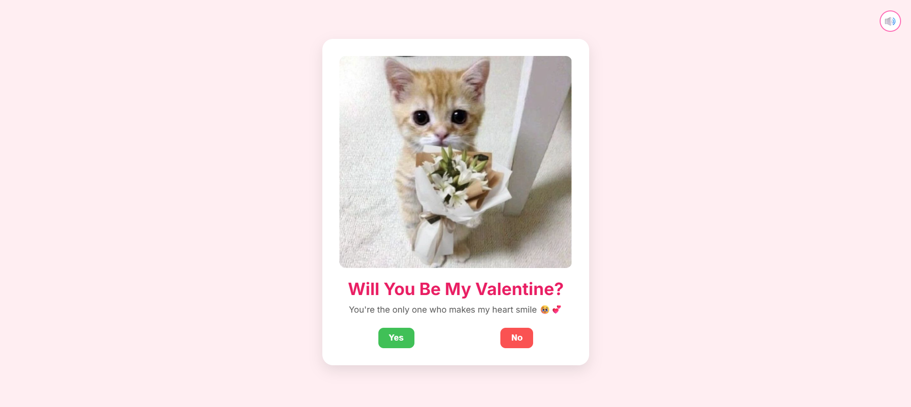

# **💌 Be My Valentine Project**
- A Cute and Interactive Valentine’s Day Proposal Web Page featuring an Adorable Kitten Holding Flowers, A heartfelt
  message and fun "Yes" / "No" buttons. Perfect for Sending a special surprise to Someone you Love!
  
## ✨ Features
- **Adorable kitten image to melt Hearts.**

- **Sweet Message: "Will You Be My Valentine?" with a Romantic Subtext.**

- **Interactive Buttons**

- **Yes button for a Happy Acceptance.**

- **No button that can be Styled to move away or give a Playful Twist.**

- **Soft pink background for a Romantic Vibe.**

- **Optional sound icon to Play Background Music.**

## 🛠 Tech Stack

- **HTML5** – Structure and Layout.
- **CSS3** – Styling, Responsiveness and Themes.
- **JavaScript (ES6)** – Conversion Logic, Interactivity and DOM Manipulation.
- **Google Fonts** – Clean and Modern typography.

## 💡Future Improvements
- **Add Kelvin conversion support.**
- **Display real-time weather data from an API.**
- **Add voice input for entering temperature.**
- **Improve animations for smoother UI transitions.**

## 📸Screenshots

Below is a Preview of **Be My Valentine Project**, Showcasing the Layout and Styling implemented Using pure HTML , CSS and Javascript. 
The Design focuses on Clean Structure, Responsiveness and Modern Styling.

